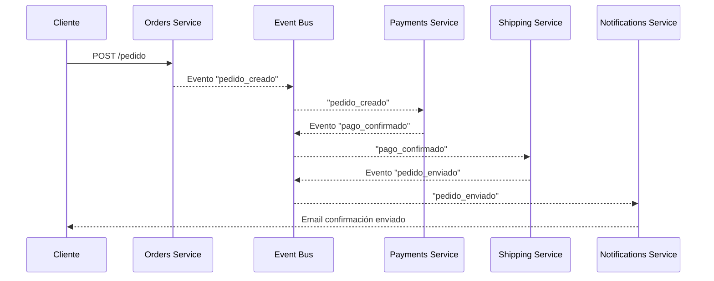
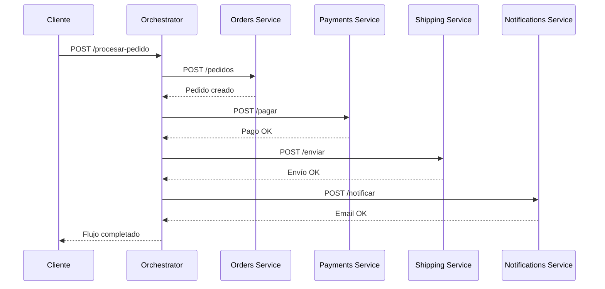
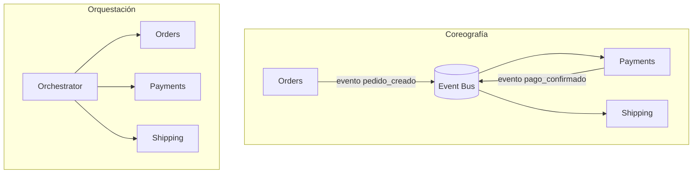

# 3.3 – Coreografía vs Orquestación en sistemas distribuidos

---

## 🎯 Objetivo

Entender los dos enfoques principales para coordinar flujos de negocio en arquitecturas distribuidas basadas en microservicios:

* **Coreografía**: la coordinación se hace **por eventos**, sin un “jefe” central.
* **Orquestación**: un servicio **orquestador** controla el flujo y decide qué servicio hace qué y cuándo.

Veremos:

* Definición de cada enfoque.
* Diagramas de flujo con **Mermaid**.
* Ejemplos funcionales en JavaScript (Node.js), usando HTTP y eventos (RabbitMQ).

---

## 🧩 El problema: ¿quién coordina el flujo?

En un monolito, los flujos de negocio se coordinan dentro del mismo proceso:

```js
function procesarPedido(pedido) {
  validarPedido(pedido);
  cobrar(pedido);
  prepararEnvio(pedido);
  enviarEmailConfirmacion(pedido);
}
```

En microservicios, cada una de esas piezas puede vivir en un servicio distinto:

* `orders-service`
* `payments-service`
* `shipping-service`
* `notifications-service`

La pregunta es:

> ¿Quién decide el orden y la lógica de este flujo?

Las dos respuestas clásicas son: **coreografía** y **orquestación**.

---

## 🕺 Coreografía: “cada servicio sabe su parte”

En la **coreografía**, no existe un coordinador central.
Cada servicio **reacciona a eventos** y, si es necesario, **emite nuevos eventos** para que otros reaccionen.

👉 El flujo se construye como una especie de “baile” donde todos saben **cuándo entrar** y **qué hacer**, pero no hay un director.

---

### 🔹 Ejemplo de flujo coreografiado

1. `orders-service` emite `pedido_creado`.
2. `payments-service` escucha `pedido_creado` → intenta cobrar → emite `pago_confirmado`.
3. `shipping-service` escucha `pago_confirmado` → prepara el envío → emite `pedido_enviado`.
4. `notifications-service` escucha `pedido_enviado` → manda correo al cliente.

### 🧭 Diagrama coreografiado (Mermaid)



No hay un “servicio central” que coordine todo.
Cada servicio escucha eventos relevantes y actúa.

---

### 🔹 Ejemplo funcional (coreografía con RabbitMQ)

> Nota: se asume que hay un bus tipo RabbitMQ accesible como `amqp://rabbitmq`.

#### `payments-service` (reacciona a `pedido_creado` y emite `pago_confirmado`)

```js
import amqp from "amqplib";

async function startPaymentsService() {
  const conn = await amqp.connect("amqp://rabbitmq");
  const ch = await conn.createChannel();

  const exchange = "eventos";
  await ch.assertExchange(exchange, "topic", { durable: true });

  const q = await ch.assertQueue("payments-service");
  await ch.bindQueue(q.queue, exchange, "pedido.creado");

  console.log("💳 Payments Service escuchando 'pedido.creado'...");

  ch.consume(q.queue, async msg => {
    const evento = JSON.parse(msg.content.toString());
    console.log("💳 Procesando pago para pedido", evento.data.id);

    // Simular pago OK
    const eventoPago = {
      tipo: "pago_confirmado",
      data: { pedidoId: evento.data.id, cliente: evento.data.cliente }
    };

    ch.publish(exchange, "pago.confirmado", Buffer.from(JSON.stringify(eventoPago)));
    console.log("📤 Evento 'pago_confirmado' publicado");

    ch.ack(msg);
  });
}

startPaymentsService();
```

#### `shipping-service` (reacciona a `pago_confirmado`)

```js
import amqp from "amqplib";

async function startShippingService() {
  const conn = await amqp.connect("amqp://rabbitmq");
  const ch = await conn.createChannel();

  const exchange = "eventos";
  await ch.assertExchange(exchange, "topic", { durable: true });

  const q = await ch.assertQueue("shipping-service");
  await ch.bindQueue(q.queue, exchange, "pago.confirmado");

  console.log("📦 Shipping Service escuchando 'pago_confirmado'...");

  ch.consume(q.queue, msg => {
    const evento = JSON.parse(msg.content.toString());
    console.log("📦 Preparando envío para pedido", evento.data.pedidoId);
    ch.ack(msg);
  });
}

startShippingService();
```

👉 Aquí no hay orquestador. El **bus de eventos** más las reglas de suscripción construyen el flujo.

---

### ✅ Ventajas de la coreografía

* **Menos acoplamiento central**: no hay un “mega servicio” que lo controle todo.
* **Alta extensibilidad**: nuevos servicios pueden suscribirse a eventos sin cambiar los existentes.
* Ideal para **event-driven architectures**.

### ⚠️ Inconvenientes

* Difícil de ver el **flujo completo**: la lógica se reparte entre múltiples servicios.
* Riesgo de “baile descontrolado” si cada servicio emite eventos sin una estrategia clara.
* Debug más complejo: hay que rastrear eventos a través de varios servicios.

---

## 🎛️ Orquestación: “un director que coordina todo”

En la **orquestación**, existe un **servicio orquestador** que:

* Decide el orden del flujo.
* Llama a cada servicio (normalmente por HTTP o mensajes directos).
* Contiene la “coreografía” como código centralizado.

👉 Piensa en una API BFF (Backend for Frontend) o en un **saga orchestrator**.

---

### 🔹 Ejemplo de flujo orquestado

1. `orchestrator-service` recibe la petición de crear pedido.
2. Llama a `orders-service` para crear el pedido.
3. Llama a `payments-service` para cobrar.
4. Llama a `shipping-service` para enviar.
5. Llama a `notifications-service` para mandar el email.

### 🧭 Diagrama orquestado (Mermaid)



El **orquestador** controla el flujo de principio a fin.

---

### 🔹 Ejemplo funcional (orquestación con HTTP)

#### Orchestrator

```js
import express from "express";
import axios from "axios";

const app = express();
app.use(express.json());

const ORDERS_URL = "http://orders-service:3000";
const PAYMENTS_URL = "http://payments-service:3001";
const SHIPPING_URL = "http://shipping-service:3002";
const NOTIFICATIONS_URL = "http://notifications-service:3003";

app.post("/procesar-pedido", async (req, res) => {
  try {
    const { cliente, productos } = req.body;

    // 1. Crear pedido
    const pedidoRes = await axios.post(`${ORDERS_URL}/pedidos`, { cliente, productos });
    const pedido = pedidoRes.data;

    // 2. Cobrar
    await axios.post(`${PAYMENTS_URL}/pagar`, { pedidoId: pedido.id, total: pedido.total });

    // 3. Preparar envío
    await axios.post(`${SHIPPING_URL}/enviar`, { pedidoId: pedido.id, direccion: pedido.direccion });

    // 4. Notificar
    await axios.post(`${NOTIFICATIONS_URL}/email-confirmacion`, { pedidoId: pedido.id, cliente });

    res.json({ status: "ok", pedidoId: pedido.id });
  } catch (error) {
    console.error("❌ Error en orquestación:", error.message);
    res.status(500).json({ error: "Fallo en el flujo orquestado" });
  }
});

app.listen(4000, () => console.log("🎛️ Orchestrator escuchando en puerto 4000"));
```

👉 El orquestador sabe el **workflow completo**, y las demás piezas solo exponen operaciones simples.

---

### ✅ Ventajas de la orquestación

* Flujo más **visible y centralizado**.
* Un único lugar para aplicar **reintentos, compensaciones, logs, timeouts**, etc.
* Más fácil razonar sobre sagas complejas (por ejemplo, deshacer pasos previos si uno falla).

### ⚠️ Inconvenientes

* Riesgo de crear un **“mega servicio”** que se convierte en un nuevo monolito lógico.
* Mayor acoplamiento: todos dependen del orquestador.
* Si el orquestador falla, el flujo completo se ve afectado.

---

## 🧠 Coreografía vs Orquestación: comparativa



| Aspecto                 | Coreografía             | Orquestación                         |
| ----------------------- | ----------------------- | ------------------------------------ |
| Control del flujo       | Distribuido             | Centralizado                         |
| Acoplamiento            | Bajo (entre servicios)  | Mayor hacia el orquestador           |
| Visibilidad del proceso | Difusa                  | Clara (un solo punto)                |
| Extensibilidad          | Alta (añadir listeners) | Media (hay que tocar el orquestador) |
| Complejidad             | Repartida               | Concentrada                          |

---

## 🧩 ¿Cuándo usar cada enfoque?

**Coreografía – recomendable cuando:**

* El flujo es **simple** y natural por eventos.
* Quieres minimizar la lógica centralizada.
* Necesitas alta **extensibilidad** (añadir más servicios “escuchando” un evento).

**Orquestación – recomendable cuando:**

* El flujo es complejo, con muchos pasos y posibles compensaciones.
* Necesitas **sagas transaccionales** (deshacer pasos en caso de fallo).
* Quieres tener un punto único de control y monitoreo del proceso.

En sistemas reales, lo habitual es **combinar ambos**:
algunos flujos se orquestan, otros se coreografían, e incluso un orquestador puede emitir eventos que otros servicios usen de manera coreografiada.

---

## 🔚 Conclusión

* La **coreografía** favorece la **descentralización y extensibilidad**, pero puede complicar la visibilidad del flujo.
* La **orquestación** ofrece **control y claridad**, pero aumenta el acoplamiento hacia el orquestador.
* Elegir uno u otro (o una combinación) es una decisión **de diseño arquitectónico**, no solo técnica.

Ambos enfoques son fundamentales para diseñar **flujos de negocio distribuidos** en arquitecturas de microservicios modernas.

